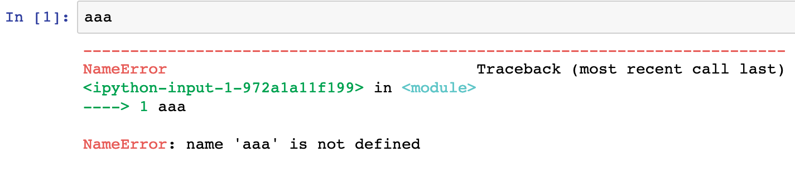
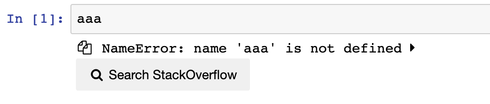

traceback2overflow
==============

This nbextension builds on the skip-tracebacks Jupyter extension, summerizing a traceback error and type. It also adds a button to a given traceback that searches StackOverflow for the error.

Clicking the summary displays the full traceback.


Example
-------

With normal traceback:



With nbextension enabled:




Using the (optional) toolbar button, you can show or hide all tracebacks in the
notebook at once.


Options
-------

The nbextension provides a few options, the values of which are stored in the
notebook section of the nbconfig. The easiest way to configure these is using
the
[jupyter_nbextensions_configurator](https://github.com/Jupyter-contrib/jupyter_nbextensions_configurator)
serverextension, but you can also configure them directly with a few lines of
python.

The available options are:

* `t2o.animation_duration` - duration (in milliseconds) of the
  show/hide traceback animations. Defaults to `100`.

* `t2o.button_icon` - a
  [fontawesome](https://fontawesome.com/icons)
  class name, used for the action and toolbar button.
  Defaults to `fa-warning`.

* `t2o.show_copy_buttons` - add buttons to headings to copy the
  full traceback to the clipboard. Defaults to `false`.

* `t2o.use_toolbar_button` - add a button to the toolbar which can
  be used to toggle on or off the contracted display of all cells' tracebacks.
  Defaults to `false`.

* `t2o.enable` - enable collapsing the tracebacks on loading the
  nbextension. Defaults to `true`

* `t2o.show_search_buttons` - add button to traceback summery to search the
  traceback on StackOverflow. Defaults to `true`


For example, to set the animation time to half a second, and enable adding the
toolbar button, we can use the following python snippet:

```python
from notebook.services.config import ConfigManager
cm = ConfigManager()
cm.update("notebook", {"t2o": {
    "animation_duration": 500,
    "use_toolbar_button": True,
}})
```


Internals
---------

This extensions works by overriding the `OutputArea.prototype.append_error`
function to add a header above the error text, which can be used to show or
hide the traceback.

On loading the extension, only outputs added to cells after the `append_error`
method has been patched are initially affected. In order to apply the collapse
to pre-existing outputs, the nbextension loops through existing uncollapsed
tracebacks, storing them to json, clearing them, then restoring them from the
saved json.
